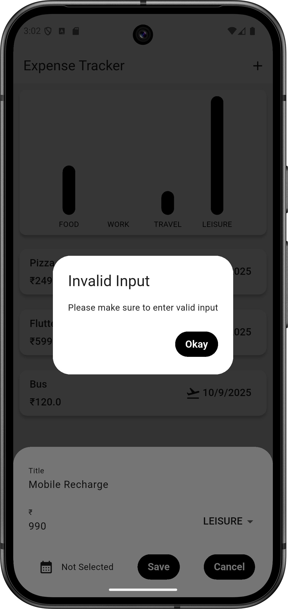
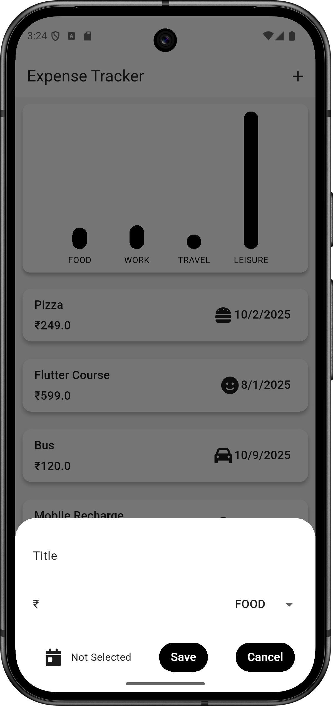
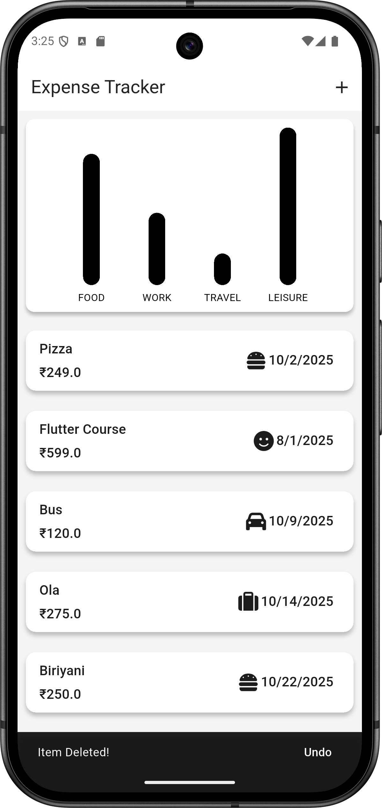
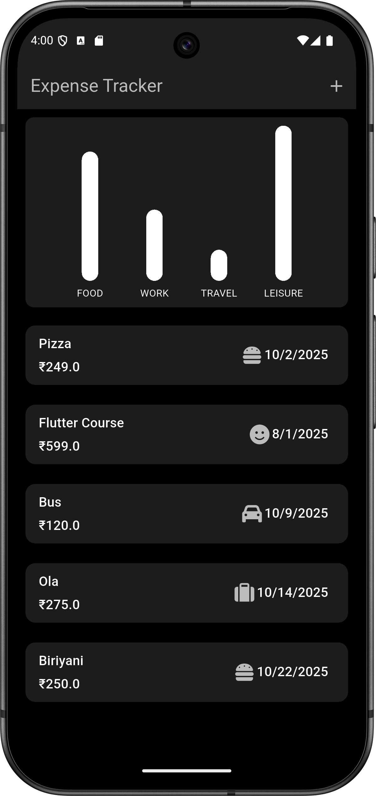

# Expense Tracker Flutter App

A fully functional Flutter app to track personal expenses with features like:
- Categorized expense tracking
- Interactive charts
- User-friendly UI

## Screenshots





## Features
- Add, Delete and see the Chart of expenses
- View expenses by category
- Responsive and clean UI
- Uses FontAwesomeIcons

## Technologies Used
- Flutter
- Dart
- MVVM 
- FontAwesomeicons

## How to Run
1. Clone the repository
```bash
git clone https://github.com/yourusername/flutter_expense_tracker.git
