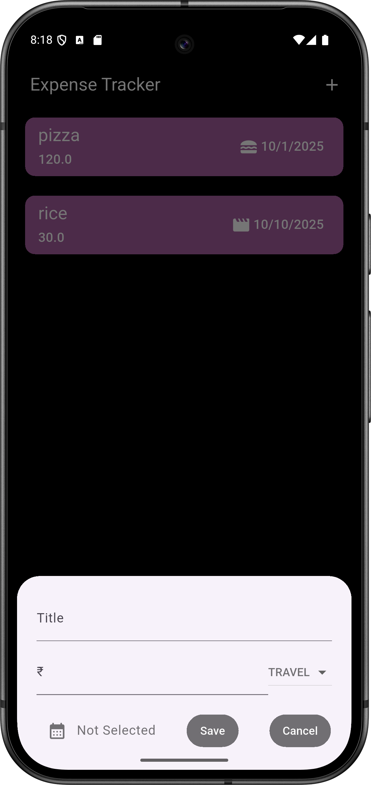
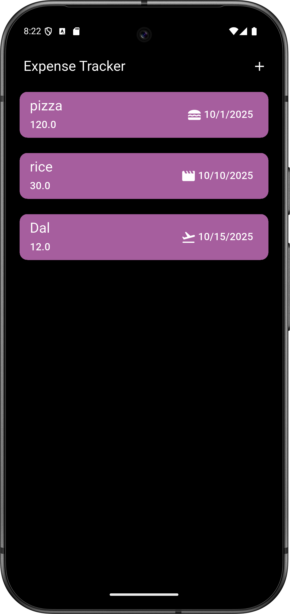

# Expense Tracker Flutter App

A fully functional Flutter app to track personal expenses with features like:
- Categorized expense tracking
- Interactive charts
- User-friendly UI

## Screenshots



## Features
- Add, edit, and delete expenses
- View expenses by category
- Responsive UI for both Android & iOS

## Technologies Used
- Flutter
- Dart
- Firebase (optional)
- BLoC for state management

## How to Run
1. Clone the repository
```bash
git clone https://github.com/yourusername/flutter_expense_tracker.git
